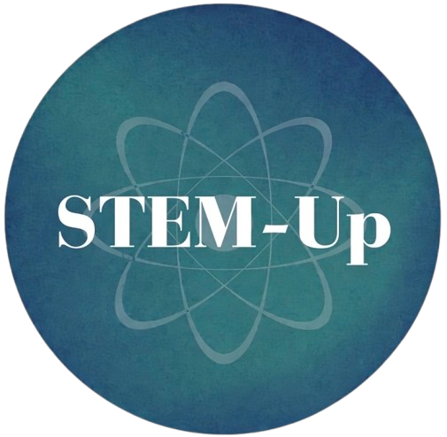

# Lost at Sea: Bridge Portal — STEM Maritime Navigation Simulation

An interactive, real-time STEM educational simulation designed for museum workshops and youth outreach. Participants act as specialized bridge teams navigating the Persian Gulf to Al Wakrah Port using real-world navigational data, visual cues, and environmental telemetry.



## 🌟 Key Features
* **Real-Time Synchronized Gameplay:** Socket.io backend coordinates turn states, team recommendations, and final route outcomes across all participant mobile/tablet devices.
* **Randomized Decision Engine:** Utilizes dynamic Fisher-Yates array shuffling for shift options to ensure active problem-solving during team rotations.
* **Fail-Safe Route Logic:** Automatically evaluates team telemetry at Shift 3 to branch between successful harbor arrival, off-course drifting, or reef grounding with a detailed mistake log.
* **Multi-Role Specialization:** Interfaces customized for 4 distinct divisions:
  * ☀️ **Team Celestial:** Sun shadows, Kamal altitude tools, Polaris/Suhail tracking.
  * 🌬️ **Team Environmental:** Al-Shamāl wind drift, tidal current vectors.
  * ⚓ **Team Traditional:** Lead-line soil sampling, wildlife flight vectors, reef bioluminescence.
  * 📡 **Team Digital:** Bathymetric sonar profiling and GPS latitude tracking.

## 🛠️ Tech Stack
* **Backend:** Node.js, Express, Socket.io
* **Frontend:** HTML5, CSS3 (CSS Variables, Responsive Grid), Vanilla JavaScript (ES6+)
* **Networking/Deployment:** Local IPv4 / `ngrok` HTTP tunneling for network isolation bypass
* **Media & Hardware:** Integrated SVG diagrams, synchronized ambient maritime audio, field manuals

## 🚀 Quick Start


1. **Clone the repository:**
   ```bash
   git clone [https://github.com/herfiuh/lost-at-sea.git](https://github.com/herfiuh/lost-at-sea.git)
   cd lost-at-sea
   